<div align="center">



<br/><br/>

[](https://github.com/Chandann118)
[](https://github.com/Chandann118)
[](https://spring.io/projects/spring-boot)
[](https://leetcode.com/u/Chandann118)
[](https://www.linkedin.com/in/chandann118)
[](http://instagram.com/chandann118)

</div>

---

### `// 01. SYSTEM_OVERVIEW`

Hi there! I'm **Chanda kumar Yadav**, a **B.Tech (Information Technology)** student specializing in **Backend Engineering** with **Spring Boot** and passionate about algorithmic problem solving on **LeetCode**.

```bash
chandann118@terminal:~$ neofetch --profile
  OS        : Linux / JVM Environment
  HOST      : Chandann118
  KERNEL    : Spring Boot Framework
  EDUCATION : B.Tech (Information Technology)
  FOCUS     : Backend Systems & Core Algorithms
  STATUS    : Active Student & Developer
  LEETCODE  : https://leetcode.com/u/Chandann118
```

---

### `// 02. TECHNICAL_FOCUS`

```
┌─────────────────────────────────┬─────────────────────────────────┐
│ DOMAIN                          │ TECHNOLOGIES & DISCIPLINES      │
├─────────────────────────────────┼─────────────────────────────────┤
│ Backend Development             │ Spring Boot · Java · REST APIs  │
│ Algorithmic Problem Solving     │ Data Structures & Algorithms    │
│ Platform & Version Control      │ Git · GitHub · Bash / Terminal  │
│ Academic Discipline             │ Information Technology          │
└─────────────────────────────────┴─────────────────────────────────┘
```

#### Key Technical Strengths:
- **Server-Side Development**: Designing and building RESTful web services with **Spring Boot** and **Java**.
- **Data Structures & Algorithms**: Continuous problem solving and complexity optimization on **LeetCode**.
- **Clean Architecture**: Structuring backend code with clean separation of concerns and maintainable design patterns.
- **Version Control & Workflows**: Collaborative development, repository management, and code hygiene using **Git** & **GitHub**.

---

### `// 03. PROBLEM_SOLVING & ALGORITHMS`

Solving core algorithmic challenges and mastering foundational data structures:

- **Platform**: [LeetCode Profile (@Chandann118)](https://leetcode.com/u/Chandann118)
- **Focus Areas**:
  - Arrays, Strings, and Two Pointers
  - Linked Lists, Stacks, and Queues
  - Trees, Binary Search, and Graphs
  - Dynamic Programming & Recursion

---

### `// 04. ACADEMIC_BACKGROUND`

- **Degree**: Bachelor of Technology (**B.Tech in Information Technology**)
- **Focus**: Information Technology Systems, Object-Oriented Programming, Database Management, Data Structures & Algorithms, and Operating Systems.

---

### `// 05. CONNECT & CONTACT`

Feel free to connect, collaborate, or discuss backend engineering and technology:

| Channel | Link |
| :--- | :--- |
| **GitHub** | [@Chandann118](https://github.com/Chandann118) |
| **LinkedIn** | [linkedin.com/in/chandann118](https://www.linkedin.com/in/chandann118) |
| **LeetCode** | [leetcode.com/u/Chandann118](https://leetcode.com/u/Chandann118) |
| **Instagram** | [@chandann118](http://instagram.com/chandann118) |
| **Direct Email** | [chandnn188@gmail.com](mailto:chandnn188@gmail.com) |

<br/>

<div align="center">
  <sub><code>chandann118@server:~$ echo "Designing robust backends &amp; solving core algorithms."</code></sub>
</div>
